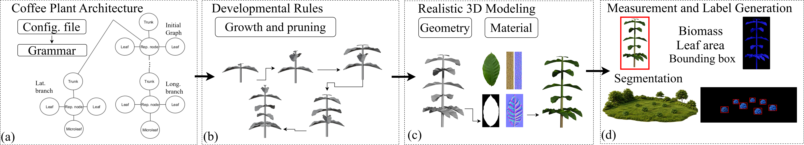
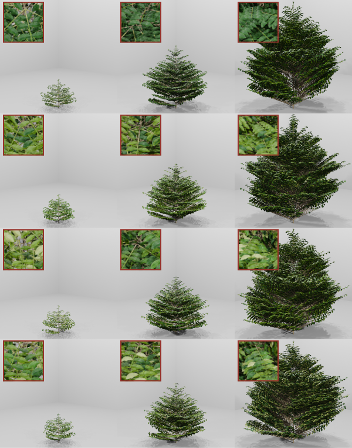

# CoffeeGen-Plant-SIBGRAPI-2026
Official repository for CoffeeGen-Plant (SIBGRAPI 2026). A procedural framework for 3D coffee plant generation with explicit structural representation for agricultural vision and synthetic datasets.



The **CoffeeGen-Plant** pipeline operates on a decoupled architecture, separating the underlying botanical topology from its visual representation into two fundamental stages:

1. **Logical Model Generation:** The procedural engine first constructs a structural, graph-based *logical model*. Governed by botanical growth rules and parameters, this model defines the entire architecture of the coffee plant (such as hierarchy, branching angles, and leaf distribution) using pure mathematical and structural data, without geometric overhead.
2. **Geometric and Material Instantiation:** Subsequently, this logical model is translated into the 3D space. The structural nodes are coupled with their respective 3D *meshes* and textured using our high-fidelity dataset of real leaf and trunk *materials*. This process gives visual form to the logical structure, culminating in the final photorealistic 3D model, ready for simulation, automatic annotation, and export.



> **Status:** The code and dataset are being organized for public release and will be made available in this repository soon. Watch/star the repository to be notified once they are published.

If you find this work useful for your research, please cite our paper:

```bibtex
@inproceedings{silva2026,
  author = {
    Willison Silva and
    Kayo Lage and
    Caio Cândido and
    Bruno Sette and
    Murillo Teixeira and
    Gabriel Serafini and
    Edgard Picoli and
    Fábio Tancredi and
    Williams Ferreira and
    Michel Silva and
    Thiago Gomes
  },
  title = {Procedural Modeling of Coffee Plants with Explicit Structural Representation},
  booktitle = {2026 39th SIBGRAPI Conference on Graphics, Patterns and Images (SIBGRAPI)},
  year = {2026},
   volume={},
  number={},
  doi={}
}
```

## Contact

### Authors

| Willison Silva | Kayo Lage | Caio Cândido | Bruno Sette | Murillo Teixeira | Gabriel Serafini | Edgard Picoli | Michel Silva | Thiago Gomes |
|---|---|---|---|---|---|---|---|---|
| Student¹ | Student¹ | Student¹ | Student¹ | Student¹ | Student¹ | Assistant Professor¹ | Assistant Professor¹ | Assistant Professor¹ |
| willison.silva@ufv.br | kayo.lage@ufv.br | caio.candido@ufv.br | bruno.sette@ufv.br | murillo.teixeira@ufv.br | gabriel.serafini@ufv.br | epicoli@ufv.br | michel.m.silva@ufv.br | thiago.luange@ufv.br |

¹Universidade Federal de Viçosa
Departamento de Ciência da Computação
Viçosa, Minas Gerais, Brazil

**External collaborators:** Fábio Tancredi (EPAMIG), Williams Ferreira (EMBRAPA)

## Laboratory

**MaVILab: Machine Vision and Intelligence Laboratory**
https://mavilab-ufv.github.io/

## Acknowledgements

We thank CAPES, FAPEMIG (PPE-00047-21), CNPq (444648/2024-0), Idata-UFV, FINEP (IA-AD-UFV \#0284/22), Cluster/UFV, EPAMIG, and EMBRAPA (ConCafé \#10.24.22.032.00.00/337). 
